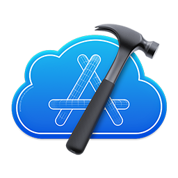

# Mert Tecimen

Hey there! I'm an iOS developer and UI/UX designer. I love exploring new technologies that can help me improve my application development process. I can create apps from scratch or maintain existing ones. You might find me at community events and hackathons, where I've had some pretty exciting experiences. If you want to get in touch, feel free to reach out to me on <a href="https://www.linkedin.com/in/mmt-2000">LinkedIn</a>. I often share interesting things I come across while developing there.
 
Also, my GitHub account showcases my contributions and side projects, which I use as my portfolio. Check it out!

---

### Tech Stack and Tools

 

#

### Stats

